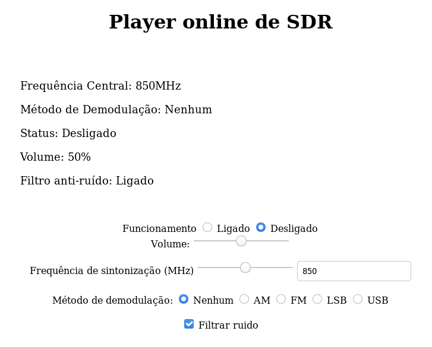

# Projeto final de sistemas de comunicações

Este é o projeto final da disciplina de sistemas de comunicações. Ele é um sistema de rádio definido por _software_ 
(em inglês _software-defined radio_ ou SDR) para recepção
e demodulação de ondas de rádio dentro do espectro de 500 kHz até 1700 MHz que realiza as demodulações AM, FM, LSB e USB e que é
acessado por navegador permitindo acesso remoto ao áudio, embora apenas suporte uma pessoa por vez. A recepção das ondas é feita
por um _dongle_ RTL-SDR e duas antenas dipolo ligadas juntas.

O usuário pode ligar e desligar o áudio, controlar seu volume, controlar a frequência de sintonia, o método de demodulação
empregado (ou nenhum para ouvir o sinal bruto) e ligar ou desligar um filtro de ruídos.

Os arquivos referentes ao projeto final estão na pasta nodejs. A pasta matlab contém os _scripts_ de matlab usados para os testes
iniciais do algoritmo e que foram mantidos aqui para fins didáticos.

## Objetivos do projeto

1. Estudar técnicas de rádio definido por _software_ e processamento digital de sinais que forem pertinentes ao tema do projeto, como
modulação por quadratura, demodulações AM, FM, LSB e USB e filtragem.
2. Estudar o funcionamento e uso de dispositivos de rádio definido por _software_, em particular, o RTL-SDR utilizado neste projeto
3. Implementar um sistema que controle um dispositivo RTL-SDR e faça a demodulação, filtragem e decimação do sinal recebido podendo
alterar a configuração destes processos em tempo real e que seja controlado por e envie o áudio resultante para um usuário de forma
remota utilizando _internet_ e por meio de um _site_.

## Instalação

### Dependências

- Um RTL-SDR
- Software Node.js versão 10.X.X e as dependências listadas no package.json
- [Biblioteca rtl-sdr (versão de IncognitoJam) e suas dependências libusb e librtlsdr-dev](https://github.com/IncognitoJam/rtl-sdr)
- Browser Firefox 25+, Google Chrome 35+ ou outro que suporte a [API WebAudio](https://developer.mozilla.org/en-US/docs/Web/API/Web_Audio_API#Browser_compatibility)

### Método de instalação

Para o RTL-SDR, ... (COLOCAR A PARTE DO RTL-SDR DEPOIS)

	git clone 'https://github.com/r0100/proj-final-siscom.git'

	cd proj-final-siscom/nodejs

	npm install IncognitoJam/rtl-sdr

	npm install

	npm run build-server

	npm start

## Método de uso

Ao iniciar o servidor, o endereço local em que ele está disponível será mostrado na linha de comandos e já poderá ser acessado com o navegador
assim que o RTL-SDR estiver em funcionamento. A interface de uso do sistema é esta:

A forma alterar a configuração do áudio recebido é bem simples e clara. Por padrão, navegadores proíbem que áudio controlado pela API WebAudio seja
iniciado automaticamente, razão pela qual é necessário ligá-lo na primeira opção da interface. A frequência de sintonia é alterada tanto pelo 
controle deslizante quanto pela caixa de texto ao lado. A escolha do método de demodulação e ativação e desativação do filtro contra ruídos é 
evidente.

As informações são automaticamente atualizadas no painél superior, podendo haver um pequeno _delay_ entre a mudança das configurações e atualização
do áudio. Como supracitado, o sistema só suporta uma pessoa por vez, alguém subsequente poderá interagir com a página, mas não ouvirá nada.
